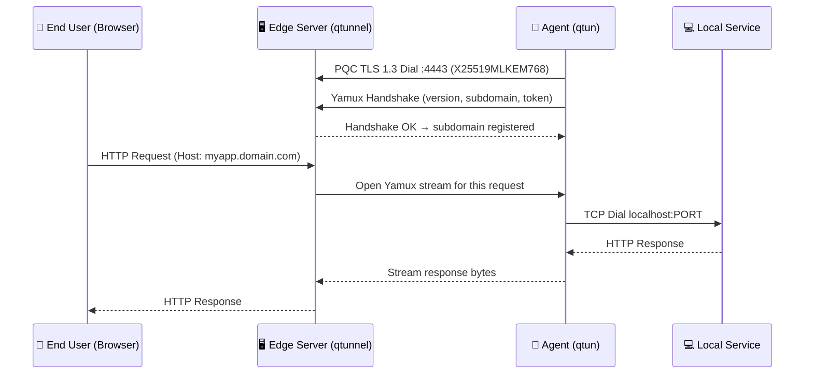
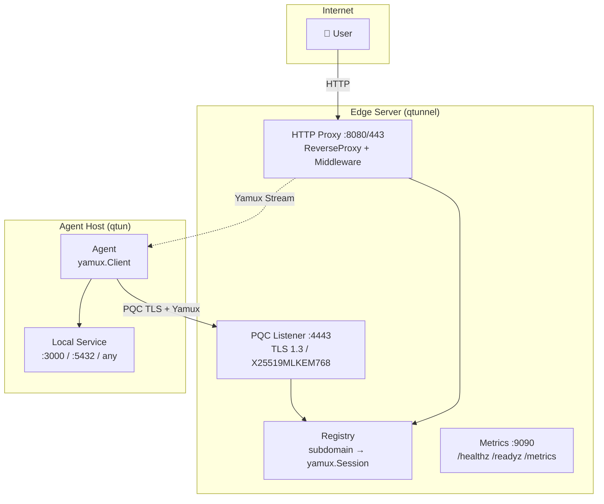
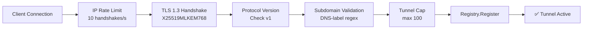

# PostQ-Tunnel
[](https://github.com/Cyber-Def/postq-tunnel/actions/workflows/ci.yml)

[Українська](docs/uk/1_INSTALL.md) | [English](docs/en/1_INSTALL.md) | [Deutsch](docs/de/1_INSTALL.md) | [中文](docs/zh/1_INSTALL.md) | [Русский](docs/ru/1_INSTALL.md)

A modern, highly secure, Quantum-Resistant reverse proxy designed to expose your local development and AI agent automation services to the internet.

`PostQ-Tunnel` acts as a drop-in single-binary replacement for services like `ngrok`. It is designed for teams, implementing Identity-Aware layer features, zero-dependency deployments, and post-quantum security.

## Highlights
- **Post-Quantum Cryptography** — The control channel uses `X25519MLKEM768` TLS 1.3 (Go 1.24+), protecting against *Store-Now-Decrypt-Later* quantum decryption attacks.
- **Zero-Dependency** — Pure Go. No Caddy, no OpenSSH, no Python.
- **Yamux Multiplexing** — Millions of HTTP requests over a single PQC-secured stream.
- **Team-Oriented Middleware** — Native IP/CIDR whitelisting, BasicAuth with brute-force lockout, and SSO stubs.
- **Observability** — Built-in Prometheus `/metrics`, `/healthz`, `/readyz` endpoints on port `9090`.
- **Protocol Versioning** — Handshake version check ensures agent ↔ server compatibility.
- **DoS Hardened** — Rate-limited handshakes (10/s per IP), tunnel cap (100), payload size limit (4KB), and subdomain validation.

---

## Architecture

### Connection Flow



### Component Overview



### Security Layers



---

## Getting Started

### Build from Source

```bash
# Build the Agent
go build -o qtun ./cmd/qtun/main.go

# Build the Edge Server
go build -o qtunnel ./cmd/server/main.go
```

### Docker Quick Start

```bash
# Clone and run with Docker Compose (local mode, no TLS required)
cd deploy/
docker compose up

# Test the tunnel (agent mounts subdomain "demo")
curl -H "Host: demo.localhost" http://localhost:8080/
```

### Running Edge Server (Production)

```bash
export QTUN_DOMAIN="tunnels.yourdomain.com"
export QTUN_EMAIL="admin@yourdomain.com"
./qtunnel
```

The server binds to:
- `:443` — HTTPS with automatic Let's Encrypt certs (CertMagic)
- `:4443` — PQC TLS agent control plane
- `:9090` — Prometheus metrics + health endpoints

### Running Client Agent

```bash
# Expose local port 3000 as react-preview.tunnels.yourdomain.com
./qtun -server yourvps.com:4443 -sub react-preview -local localhost:3000

# Expose with IP whitelist (only VPN range allowed)
./qtun -server yourvps.com:4443 -sub internal-db -local localhost:5432 -allow-ip 192.168.1.0/24

# Expose with Basic Auth
./qtun -server yourvps.com:4443 -sub staging -local localhost:8080 -auth user:secret
```

---

## Security

See [SECURITY.md](SECURITY.md) for the full threat model, accepted risks, and disclosure policy.

Key protections:
| Layer | Mechanism |
|---|---|
| Transport | TLS 1.3 + ML-KEM-768 (Post-Quantum hybrid) |
| Handshake | Protocol version check, 4KB payload cap |
| Connection | IP rate limit: 10 handshakes/s, max 100 tunnels |
| Auth brute-force | 20 fails / 30s → 1 min lockout (per IP) |
| Subdomain | DNS-label validation (a-z0-9, hyphens, ≤63 chars) |
| Replay / Downgrade | TLS 1.3 forward secrecy + ProtocolVersion field |
